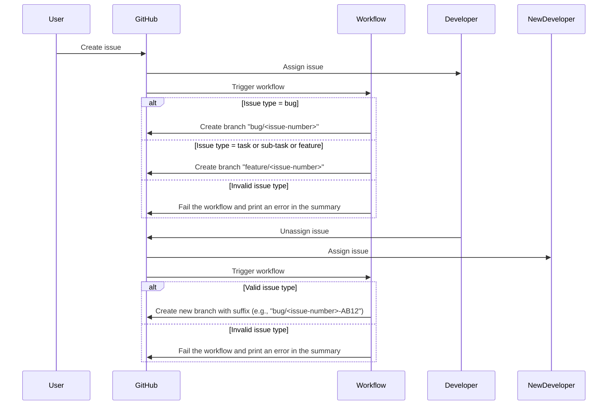

# Create Feature Branch Composite Action

&nbsp;&nbsp;&nbsp;&nbsp;&nbsp;&nbsp;&nbsp;&nbsp;&nbsp;&nbsp;[](https://github.com/marketplace/actions/create-feature-branch)

A GitHub Composite Action to automatically create a feature branch from an issue using the GitHub API.



## Prerequisite

The repository name must follow the pattern:

```text
<Numeric Project Sequence>-<Project Code>-<Short Description>
```

**Example:** `001-PORTAL-dark-mode-support`

## Features

- Creates a new branch based on an existing GitHub issue.
- Builds the branch name using project metadata and a truncated, slugified issue title.
- Posts a comment on the issue with a link to the new branch.
- Branch naming format:

  ```text
  <Issue Type>/<Project Code>-<Project Sequence>.<Issue Number>-<Truncated Slugified Title>
  ```

## Inputs

| Name           | Description                                       | Required | Default |
|----------------|---------------------------------------------------|----------|---------|
| `base-branch`  | The base branch to create the new branch from.    | No       | `main`  |
| `title-length` | Number of characters to keep from issue title.    | No       | `15`    |
| `github-token` | GitHub token with repo access.                    | Yes      | –       |
| `dry-run`      | Simulate the process only without creating branch.| Yes      | `false` |

## Sample Usage

```yaml
on:
  issues:
    types: [opened, assigned]

jobs:
  create-feature-branch:
    runs-on: ubuntu-latest
    permissions:
      issues: write
      contents: write
    steps:
      - uses: subhamay-bhattacharyya-gha/create-branch-action@v1.0.0
        with:
          github-token: ${{ secrets.GITHUB_TOKEN }}
          title-length: 20
```

> **Note:** This action is triggered by issue events. Be sure your workflow listens to events like `opened` or `assigned`.

## How It Works

1. Extracts the issue number and title.
2. Builds the branch name in this format:

   ```text
   <Issue Type>/<Project Code>-<Project Sequence>.<Issue Number>-<Truncated Slugified Title>
   ```

3. Uses the GitHub API to create the new branch from the base branch.
4. Comments on the issue with a link to the new branch.

## Example Output

**Given:**

- Repository: `001-PORTAL-dark-mode-support`
- Issue: #123 titled `Add support for dark mode`

**Generated branch:**

```text
feature/PORTAL-001.123-add-support
```

## Requirements

- `jq` (used internally for parsing JSON)
- A GitHub token with `repo` and `issues` permissions

## License

MIT
